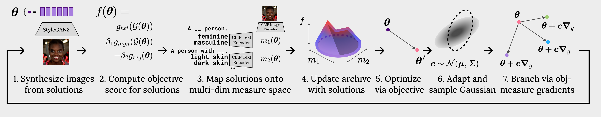

# Quality-Diversity Generative Sampling

A **quality-diversity generative sampling (QDGS) implementation** utilizing quality-diversity optimization to create synthetic data for learning representations. This framework uses [CMA-MAEGA](https://github.com/icaros-usc/cma_mae) and text prompts for fine-grained guidance over the optimal quality objective and measures of diversity of synthetic data sampling, without re-parameterization or fine-tuning of generative models. With synthetic datasets generated by QDGS, we debias color-biased shape and facial recognition classifiers. 



## Installation
This project builds in [Anaconda](www.anaconda.com). 

Once installed, create and activate the conda environment:
```
$ conda env create -f environment.yml
```

### Facial Recognition Dependencies
For reproducibility, a modified version of the [Adaface repository](https://github.com/mk-minchul/AdaFace) is included. To run the facial recognition experiments, you should install the required dependencies:
```
$ cd facial_recognition
$ pip install -r AdaFace/requirements.txt
```

## Pretrained Models and Additional Code
**Shapes Domain:**
The pretrained generator weights are provided in the repository and will be automatically loaded.

**Facial Recognition Domain:**
To run the facial recognition experiments, you must first download `stylegan2-ffhq-256x256.pkl` from the [NVIDIA website](https://catalog.ngc.nvidia.com/orgs/nvidia/teams/research/models/stylegan2/files). Place the `.pt` file in the folder `facial_recognition/pretrained`.

The QDGS code builds on the LSI (StyleGAN2) experiments from the [CMA-MAE repository](https://github.com/icaros-usc/cma_mae), which includes dnnlib and torch_util from the [StyleGAN2-Ada repository](https://github.com/NVlabs/stylegan2-ada) for replicability, the [StyleGAN3+CLIP notebook](https://colab.research.google.com/github/ouhenio/StyleGAN3-CLIP-notebook/blob/main/StyleGAN3%2BCLIP.ipynb) and [repository](https://github.com/ouhenio/StyleGAN3-CLIP-notebooks) from the generative art community.
We include a modified version of the facial recognition training code from the [Adaface repository](https://github.com/mk-minchul/AdaFace).

## Data Generation
To generate data, activate the conda environment and run the `generate_data.py` script with the desired task argument (`shapes` or `facial_recognition`):
```
$ conda activate qdgs_exps
$ python3 generate_data.py --task [task]
```

## Shape Experiments
### Training and Evaluation
To train and evaluate the shapes classifier, enter the shapes directory, and run the training script:
```
$ cd shapes
$ sh train_eval.sh
```

## Facial Recognition Experiments
### Real Dataset Download
The following instructions are adapted from the [Adaface repository](https://github.com/mk-minchul/AdaFace).

1. Download the desired dataset from the [Insightface links](https://github.com/deepinsight/insightface/tree/master/recognition/_datasets_).
2. Unzip the dataset to `facial_recognition/data/faces_real`.
4. For preprocessing run
```
$ cd facial_recognition
$ python AdaFace/convert.py --rec_path data/faces_real --make_validation_memfiles
```


### Training and Evaluation
To train and evaluate the facial recognition classifier, enter the shapes directory, and run the training script:
```
$ cd facial_recognition
$ sh train_eval.sh
```